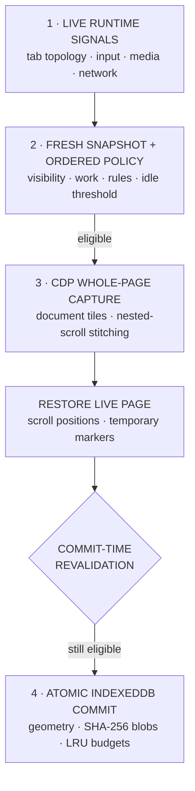
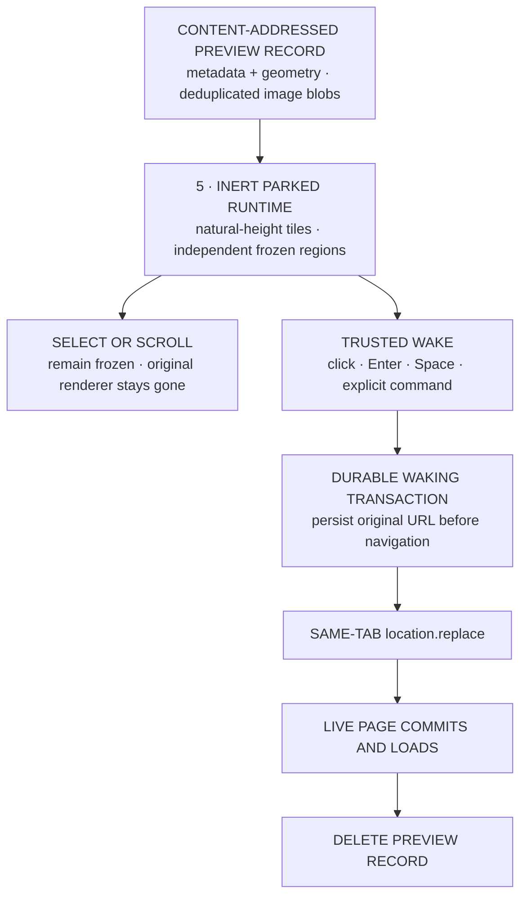
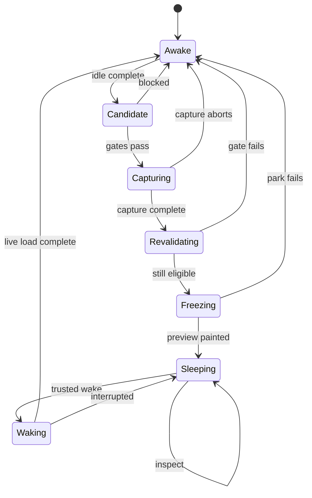

# Tab Sleep

Tab Sleep is a Chrome Manifest V3 tab-runtime that replaces inactive web applications with locally rendered, fully scrollable frozen pages—without waking them when selected.

Unlike native tab discarders, Tab Sleep does not turn selection into an implicit reload. It separates **inspection** from **execution**: selecting a sleeping tab shows its frozen state immediately; a trusted click anywhere, Enter, or Space deliberately restores the live application in the same tab.

Its eligibility engine protects visible windows, active media, meaningful network work, and streaming responses. Its capture engine records entire documents plus significant nested scroll surfaces used by application-style sites. Its parked runtime reconstructs those surfaces from local IndexedDB blobs while the original renderer remains gone.

## Core architecture

### Freeze pipeline



Runtime evidence enters policy, capture obtains the complete visual state, and the final eligibility gate runs only after capture has restored every temporary change to the live page.

### Parked runtime and wake path



The parked runtime reads immutable IndexedDB records without retaining the original renderer. Inspection never crosses into the wake path; only a trusted gesture or explicit command creates the durable transaction and restores the application.

### Freeze and wake state machine



Selection is intentionally a self-transition in `Sleeping`: it changes browser focus but not application execution. Preview cleanup occurs only after the original page completes loading, so an interrupted wake returns to the same parked record.

### Work-aware eligibility

Tab Sleep does not equate “background” with “idle.” Every freeze decision is derived from fresh browser topology and page-runtime signals:

- selected tabs in every non-minimized Chrome window remain live, including tiled windows;
- loading, audible, pinned, protected, and non-discardable tabs can remain live;
- actively consumed streaming responses remain protected for their full duration;
- substantial requests delay sleep, while quick polling and stale transport plumbing do not;
- persistent WebSockets and EventSources are not treated as work unless messages are actively arriving;
- the complete eligibility contract is revalidated immediately before the live renderer is replaced.

The engine does not inspect UI words such as “Thinking,” “Working,” or “Loading.” It tracks runtime progress rather than presentation text.

## Safety invariants

Tab Sleep never bypasses these constraints, including during manual or bulk freezes:

- no selected tab in a non-minimized window is replaced;
- no tab with stale activity proof is assumed idle;
- no actively progressing request, stream, media session, or navigation is interrupted;
- every candidate is revalidated after capture and immediately before replacement;
- a missing or damaged frozen visual never turns tab selection into an implicit wake;
- the original URL remains recoverable until a deliberate wake completes;
- preview pages are never natively discarded;
- capture never leaves temporary scroll positions or DOM markers in the live page.

### Entire-page capture

Every freeze acquires a fresh whole-page visual. A cached viewport is never promoted into a sleeping page.

The capture pipeline uses the Chrome DevTools Protocol through `chrome.debugger`:

1. attach to the background tab without focusing or selecting it;
2. measure the document through `Page.getLayoutMetrics`;
3. capture the entire document with `Page.captureScreenshot` and `captureBeyondViewport`;
4. split tall documents into clipped WebP tiles instead of allocating one unbounded bitmap;
5. discover significant nested scroll containers through page geometry and overflow behavior;
6. scroll and capture each nested region to its stable reachable extent;
7. restore every live scroll position and temporary marker before detaching;
8. persist the document shell, region geometry, and image tiles transactionally.

This supports conventional documents and application-style pages whose primary content scrolls inside internal panes rather than the document root.

### Frozen application runtime

The parked extension page reconstructs the captured page from same-origin IndexedDB blobs:

- ordinary full-page captures render at natural document height;
- tall captures render as stacked tiles, bounding decode memory;
- nested application panes are recreated as independently scrollable frozen regions;
- the status pill remains fixed and never intercepts input;
- selecting the tab does not load the original site;
- no hidden duplicate tab, retained renderer, background preload, or native discard is used.

The frozen page is deliberately inert. It preserves rendered state for inspection, not application execution.

### Transactional wake continuity

Wake is a durable state transition rather than a best-effort navigation:

1. a trusted click, Enter, Space, or explicit bulk command begins wake;
2. the service worker records a durable `WAKING` transaction before navigation;
3. the frozen page calls `location.replace(originalUrl)` in the same tab;
4. the frozen visual remains present until Chrome commits the new document;
5. the preview record is deleted only after the live URL finishes loading;
6. a failed or interrupted wake restores the parked page with retry state intact.

Service-worker and browser restarts reconcile unfinished wake transactions from durable storage.

### Content-addressed preview storage

Frozen visuals live in IndexedDB, separated into metadata and binary blob stores.

- SHA-256 content hashes deduplicate identical images;
- metadata and all referenced blobs commit in one transaction;
- preview records use per-tab and profile-wide storage budgets;
- least-recently-used cleanup removes old records when budgets are exceeded;
- orphaned metadata and blobs are reconciled after interruption;
- legacy Base64 records migrate only when their exact token is opened, preventing startup from materializing an old multi-gigabyte store.

Preview content stays inside the current Chrome profile and is never sent to an application server.

## Interaction model

1. A supported tab becomes hidden and quiet.
2. Tab Sleep waits for the configured idle interval.
3. The eligibility engine evaluates browser topology, page activity, media, requests, and stream progress.
4. The engine acquires a fresh entire-page capture and revalidates eligibility.
5. The original page is replaced with `preview/preview.html`, releasing its live renderer.
6. Selecting the tab shows the scrollable frozen page without waking the site.
7. A trusted click anywhere, Enter, or Space restores the original URL in the same tab.
8. The frozen record is retained until the live page successfully commits.

## Controls

The popup exposes the current state first and keeps power controls behind progressive disclosure:

- enable or pause automatic sleeping;
- protect the current tab;
- inspect why the current tab remains awake;
- freeze eligible tabs in the current window, other tabs, or every window;
- wake parked tabs explicitly;
- keep the current domain awake temporarily.

The settings page is limited to sleep policy, site rules, and power behavior. It does not contain session archives, activity history, or unrelated management surfaces.

## Site rules and power behavior

Rules support domain, URL-prefix, and regular-expression patterns. Deny rules take precedence over allow rules when both match.

Optional policy controls include:

- keep pinned tabs awake;
- keep audible or muted-playing tabs awake;
- respect Chrome’s non-discardable flag;
- wait for navigation to finish;
- pause sleeping while charging;
- pause sleeping while offline;
- apply a battery threshold;
- temporarily keep a tab, domain, window, or group awake.

## Installation

Requirements:

- Chrome 150 or newer;
- Developer mode enabled in `chrome://extensions`.

Install from source:

1. Clone this repository.
2. Open `chrome://extensions`.
3. Enable **Developer mode**.
4. Click **Load unpacked**.
5. Select the repository directory.

After updating the source, click **Reload** on the Tab Sleep extension card in every Chrome profile that uses it. Confirm the displayed version matches `manifest.json`.

## Permissions

Tab Sleep’s permissions correspond directly to its runtime model:

- `debugger`: background whole-page and nested-scroll capture through CDP;
- `tabs`: topology, tab metadata, and same-tab navigation;
- `scripting`: page activity probes, scroll-container capture, and inert DOM fallback;
- `storage` / `unlimitedStorage`: policy state and local content-addressed frozen visuals;
- `alarms`: periodic eligibility scans;
- `webRequest`: request-lifecycle fences;
- `contextMenus`: explicit freeze, wake, and temporary keep-awake commands;
- `<all_urls>`: activity tracking and capture coverage for supported HTTP(S) pages.

Tab Sleep never calls `chrome.tabs.discard()`.

## Fallback behavior

If CDP capture is unavailable—for example, because DevTools already owns the target—Tab Sleep can produce a detached, script-free DOM snapshot. Scripts, embedded frames, media, event-handler attributes, and meta refresh are removed before the clone is rendered in a sandboxed `srcdoc` frame.

The fallback is inert and best-effort. Canvas pixels, closed shadow roots, cross-origin frames, and runtime-only rendering may not be reproducible without CDP capture. A missing visual never causes selection to wake the original site; the tab remains parked and explicitly wakeable.

## Development

Tab Sleep has no runtime package dependencies. Development requires Node.js 20 or newer.

```bash
npm test
npm run check
```

The test suite covers:

- multi-window visibility and commit-time revalidation;
- request fences, polling, sockets, and consumed streaming responses;
- whole-document and tall-page tiled capture;
- Gmail-style nested scroll stitching and scroll-position restoration;
- rejection of cached viewport-only sleeping visuals;
- IndexedDB transactions, deduplication, budgets, migration, and reconciliation;
- parked-page selection behavior;
- durable same-tab wake, failure recovery, and restart reconciliation;
- rule precedence and temporary keep-awake scopes.

`npm run check` validates manifest permissions, referenced assets, syntax, CSP constraints, capture invariants, scrollable preview rendering, and wake semantics.

## Source map

```text
content/
  activity.js              trusted input, visibility, and media signals
  page-activity-bridge.js  request, stream, and realtime progress tracking

lib/
  policy.js                ordered eligibility engine
  engine.js                serialized freeze/wake lifecycle
  full-page-capture.js     CDP document and nested-scroll capture
  preview-store.js         transactional content-addressed IndexedDB storage
  rules.js                 domain, prefix, regex, and temporary rules

preview/
  preview.js               frozen document and nested-region reconstruction
  preview.css              natural-height and independent-scroll surfaces

service-worker.js          Chrome event adapters and command routing
```

## Privacy

All frozen visuals and runtime state stay in the local Chrome profile. Tab Sleep has no telemetry backend, analytics endpoint, account system, or cloud preview synchronization.

## License

MIT License. See [LICENSE](LICENSE).

## Version

Current version: **4.2.1**
